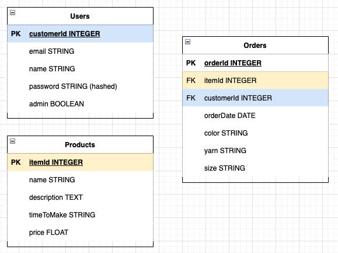

[GitHub Client Repo](https://github.com/mvanzo/Client_Stu_Knits)

# Stu Knits
Test e-commerce website allowing the Stu Knits company to sell their goods via Stripe's secure credit card checkout. Users can browse through the inventory of available knit goods, add to their cart, add quanity/remove from the cart and checkout. In current phase, Stripe's checkout only accepts the test credit card number (4242 4242 4242 4242). Users can also look up their order history. Admin privileges currently allow viewing of all orders placed via the Stripe checkout system.


[Deployed Site](https://marty-vanzo.netlify.app/)

# Tech Stack
Decoupled MERN app with Stripe API for checkout

# Planning Wireframes and ERD
## Wireframes


## ERD


## Install Instructions
1. Fork and clone this repo
2. In the terminal, run npm i to install all needed packages
3. Open client file in desired code editor
  - Create a ```.env.local``` file
    - Assign a Server Url like so:
    ```js
    REACT_APP_SERVER_URL=http://localhost:<whateverPortYouWant>
    ```
  - Move ```.env.local``` file into ```node_modules```
4. Create an account on [Stripe](https://stripe.com/) and obtain your secret key from the Developer Dashboard
    - While in testing, use `Secret key` as your API key, and if ready to deploy and accept payments use `Publishable key`
5. Open server file in desired code editor
  - Create a ```.env``` file
    - Assign a port, URI for mongoDB, and JWT secret (for tokens), like so:
    ```js
    PORT=<thisPortShouldBeTheSamePortAssignedInTheServerUrl>
    MONGODB_URI=mongodb://localhost/rankify
    JWT_SECRET="whateverYouWant"
    STRIPE_PRIVATE_KEY= paste your Stripe API key here
    ```
- Create a `.gitignore` file and place `.env` inside to be sure your API key and other sensitive info is not published online